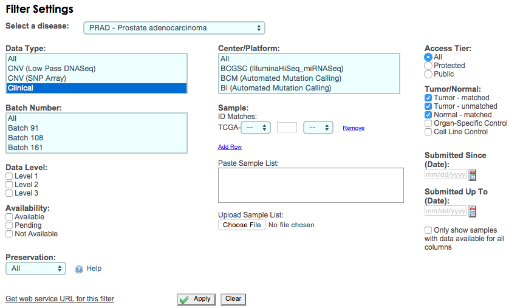

## process-reads
_Last modified `r format(Sys.time(), "%I:%M %p on %b %d, %Y")`. This document, R session image, knitr cache, figures, and other associated datasets are located in `cruncher:/inside/grotto/blin/trna-markers/prad/process-reads/`._

```{r setup, echo=FALSE, warning=FALSE, results=FALSE, message=FALSE, errors=FALSE, cache=FALSE}
library(knitr)
opts_chunk$set(cache=TRUE, cache.path="/inside/grotto/blin/trna-markers/prad/process-reads/cache/", eval=TRUE, echo=TRUE, warning=FALSE, results=FALSE, message=FALSE, autodep=TRUE, dev="png", dpi=300)
```

```{r libraries, cache=FALSE}
library(stringr)
source('/inside/grotto/blin/programs/convertChrNames.R')
```

tRNA fragments have been implicated in cancer. For instance, tRF-1001 was shown to be required for prostate cancer cell proliferation in [Lee et al. 2009](http://www.ncbi.nlm.nih.gov/pubmed/19933153). We want to generate a list of other such tRNA fragments for further analysis. Rather than looking at the differential expression of tRFs, we will use miRNAs known to be involved in cancer as a proxy for correlating tRFs with cancer. To do that, we'll generate a list of TCGA PRAD datasets and download them, re-map the reads to a feature list that includes a few key miRNAs, then generate a matrix of counts. Correlations and corresponding statistical analyses can be found in [correlate-features](correlate-features.html).

## Tumor-normal matched data
The TCGA BAM files are huge and can be upwards to 50 Gb per file at [CGHub](https://browser.cghub.ucsc.edu/). I downloaded a [summary tab-separated file](file:///Users/blin/Desktop/grotto/trna-markers/prad/prad-summary.tab), filtering for PRAD miRNA-Seq assembled with hg19/GRCh37. 

The TCGA data has a lot of extraneous samples. Each person either has one TP (primary tumor) dataset, one NT (normal tissue) dataset, or both. Newer data is preferred over older data. I first get matched TP-NT samples by participant ID, then for unmatched samples, I simply filter for the most recent sample (again by participant). Upon visual inspection, all NT datasets have at least one TP dataset from the same patient (participant). We can filter out datasets by existence of the NT file, then grab the most recent TP and NT datasets for each patient.

```{r parse-metadata-function}
parseMetadata <- function(metadata) {
  metadata <- metadata[, c('barcode', 'sample_type', 'filename', 'analysis_id', 'uploaded', 'participant_id')]
  # convert character "uploaded" column to date object for easier comparison
  metadata$uploaded <- strptime(gsub("/", "-", metadata$uploaded), "%Y-%m-%d")
  # start by getting matched pairs
  # all NT datasets have at least one TP dataset from the same patient (participant). We can filter out datasets by existence of the NT file, then grab the most recent TP and NT datasets for each patient.
  paired <- subset(metadata, participant_id %in% unique(subset(metadata, sample_type=="NT")$participant_id))
  paired$paired <- TRUE # remember which samples are matched tumor/normal
  parsed_metadata <- data.frame()
  for (current_id in unique(paired$participant_id)) {
    nt <- subset(paired, participant_id == current_id & sample_type == "NT")
    tp <- subset(paired, participant_id == current_id & sample_type == "TP")
    parsed_metadata <- rbind(parsed_metadata, tp[which(tp$uploaded == max(tp$uploaded)), ], nt[which(nt$uploaded == max(nt$uploaded)), ])
  }
  # now for the NT and TP singles. 
  singles <- metadata[which(!(metadata$participant_id %in% parsed_metadata$participant_id)), ]
  singles$paired <- FALSE
  for (current_id in unique(singles$participant_id)) {
    ps <- subset(singles, participant_id == current_id) # get all samples for this participant
    parsed_metadata <- rbind(parsed_metadata, ps[which(ps$uploaded == max(ps$uploaded)), ])
  }
  parsed_metadata
}
```

```{r parse-metadata}
prad_metadata <- read.table('/inside/grotto/blin/trna-markers/prad/prad-summary.tab', header=TRUE, sep='\t', as.is=TRUE)
prad_metadata <- parseMetadata(prad_metadata)
numbering <- match(prad_metadata$participant_id, unique(prad_metadata$participant_id)) # assign each patient new ID, internal to this analysis
prad_metadata$shortids <- numbering
numbering <- formatC(numbering, flag = "0", digits = 3) # convert to 4 digit number (may need to accomodate many more patients/samples in the future
prad_metadata$shortnames <- paste0('prad-', numbering, "-", prad_metadata$sample_type)
write(prad_metadata$analysis_id, file="prad-samples.txt")
```

A couple notes: first, it's difficult to work with the raw filenames (e.g. `TCGA-HC-8260-11A-01R-2262-13_mirna.bam`). We want to use something more along the lines of `prad-001-TP.bam`, with the number corresponding to a patient. 

Second, the analysis IDs are written to a file so `bash` can run `gtdownload`. This may take a few hours or days to run, depending on how much TCGA data there is.


```{r download-files, engine="bash"}
cd /inside/grotto/blin/trna-markers/mirna/prad
for uuid in `cat /inside/grotto/blin/trna-markers/prad/prad-samples.txt`; do
  gtdownload -c $CGKEY -d $uuid;
  rm $uuid.gto;
  mv $uuid/*.bam .;
  rm -rf $uuid
done
cd /inside/grotto/blin/trna-markers/prad/process-reads
```

```{r rename-files}
currentwd <- getwd() 
setwd('/inside/grotto/blin/trna-markers/mirna/prad')
file.rename(prad_metadata$filename, paste0(prad_metadata$shortnames, ".bam"))
setwd(currentwd)
```

## Remap reads

Originally, the plan was to remap the reads to hg19 and to the extended feature list containing tRNA halves. The main advantage of this would be to enable multimapping reads, since the original mapping maps reads to single locations. We also don't know what assembler, options, or assumptions were made for the TCGA miRNA mapping. A side benefit of remapping would be to keep the cancer data comparable with our lab internal sequencing data.* 


```{r remap, engine="bash"}
cd /inside/grotto/blin/trna-markers/mirna/prad
for prefix in `ls *-TP.bam *-NT.bam | cut -f 1 -d .`; do
  if [ ! -e $prefix-mapped.bam ]
  then
    if [ ! -e $prefix.fastq ]
    then
      bam2fastq --force -o $prefix# `readlink $prefix.bam`
      mv ${prefix}_M $prefix.fastq
      rm ${prefix}_1 ${prefix}_2
    fi
    bowtie2 -x ~/grotto/data/hg19 -k 100 -U ${prefix}.fastq -S $prefix-mapped-1.sam
    samtools view -S -F 4 -h -u $prefix-mapped-1.sam | samtools view -F 512 -h  - > $prefix-mapped-2.sam
    bowtie2-best-mapped.py $prefix-mapped-2.sam | samtools view -S -u - | samtools sort - $prefix-mapped # auto appends .bam
  fi
  rm $prefix.fastq 2> /dev/null
  rm $prefix-mapped-1.sam 2> /dev/null
  rm $prefix-mapped-2.sam 2> /dev/null
done
cd /inside/grotto/blin/trna-markers/prad/process-reads/
```

This code is adapted from external scripts. We iterate through all downloaded BAM files, convert them to fastq using `bam2fastq`, map them to hg19 and mature tRNAs with `bowtie2` with a maximum of 100 mappings, and filter out unmapped and low quality reads using `samtools`**. `bowtie2-best-mapped.py`, adapted from Andrew's script, finds the best scoring multimappings from `bowtie2` output and discards multimappings with lower scores.

For survival analysis, we also need clinical data. I don't know of a way to do this automatically, so I went to the [TCGA Data Matrix portal](https://tcga-data.nci.nih.gov/tcga/dataAccessMatrix.htm?mode=ApplyFilter) with these options:



Then, I downloaded the archive in Biotab format, and moved the file `nationwidechildrens.org_clinical_patient_prad.txt` to `prad-clinical-biotab-04012015.tab'. I also didn't know how to get the batch data, so I just copy pasted the tabular format information and formatted it manually.

```{r process-clinical-data}
prad_clinical <- read.table('prad-clinical-biotab-04012015.tab', header = TRUE, sep = "\t", stringsAsFactors = FALSE)
prad_batches <- read.table('prad-clinical-batches-04012015.tab', header = TRUE, sep = "\t", as.is = c(FALSE, TRUE))
prad_clinical$bcr_patient_uuid <- tolower(prad_clinical$bcr_patient_uuid) # all data file ids are in lowercase, not sure if matters
prad_clinical$days_survived <- replace(prad_clinical$death_days_to, prad_clinical$death_days_to == "[Not Applicable]", prad_clinical$last_contact_days_to[which(prad_clinical$death_days_to == "[Not Applicable]")]) # either days from initial prognosis to death or initial prognosis to censor time
prad_clinical$batch <- prad_batches[match(prad_clinical$bcr_patient_barcode, prad_batches$barcode), "batch"]
match_ids <- match(prad_metadata$participant_id, prad_clinical$bcr_patient_uuid)
prad_clinical <- with(prad_clinical[match_ids, ], data.frame(prad_metadata, days_survived = as.integer(days_survived), vital_status = ifelse(vital_status == "Alive", 0, 1), pathologic_T, pathologic_M, pathologic_N, gleason_score = as.integer(gleason_score), age = abs(round(as.integer(birth_days_to)/365)), batch = batch)) # maybe change to age_at _initial_pathologic_diagnosis?
```

```{r save-image, cache=FALSE}
save(prad_metadata, prad_clinical, file = 'prad-metadata.RData')
save.image("process-reads-image.RData")
```
